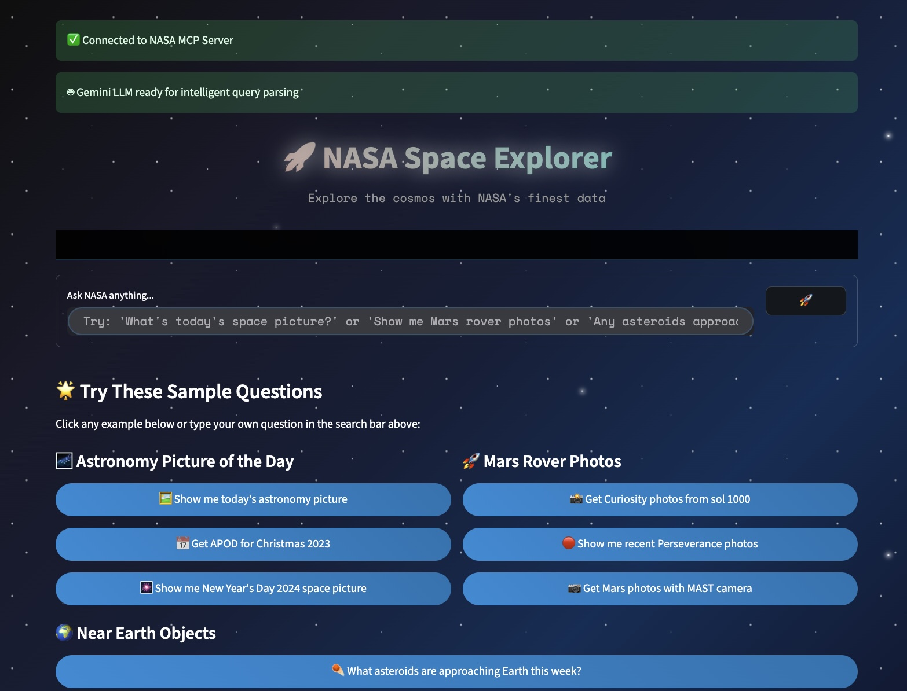

# MCP Tutorial Project

A comprehensive tutorial project demonstrating Model Context Protocol (MCP) implementations with both client and server components, supporting multiple AI models and deployment patterns.



*🚀 NASA Space Explorer - A beautiful web interface showcasing MCP integration with NASA APIs, featuring space-themed UI and intelligent natural language queries powered by Google Gemini.*

## 🌟 NASA MCP Integration

🚀 **Complete NASA API integration with web client!**

**Learn MCP by running each component individually:**

### 1. Start NASA MCP Server (stdio)
```bash
cd mcp-server
python nasa_server.py
```

### 2. Start NASA HTTP Server Wrapper
```bash
cd mcp-server/server_wrapper
python nasa_http_server_sync.py --port 8001
```

### 3. Start NASA Web App
```bash
cd mcp-client/clients/nasa/web
streamlit run nasa_streamlit_app.py --server.port=8501
```

### 4. Test NASA Components
```bash
python test_nasa.py
```

**Features:**
- 🌌 **Astronomy Picture of the Day** viewer
- 🚀 **Mars Rover Photos** browser 
- 🌍 **Near Earth Objects** tracker
- 🌐 **Streamlit Web App** with space-themed UI
- 🌐 **HTTP API** for remote access

## 📁 Project Structure

```
mcp-tutorial/
├── .git/                      # Git repository (unified)
├── .gitignore                 # Git ignore rules (unified)
├── .venv/                     # Unified virtual environment
├── .env                       # Environment variables (API keys)
├── pyproject.toml            # Unified dependencies and configuration
├── setup.sh                  # Quick setup script
├── README.md                 # This comprehensive guide
├── test_nasa.py              # NASA components test suite
├── mcp-client/               # MCP clients for different AI models
│   ├── clients/
│   │   ├── anthropic/        # Claude MCP clients
│   │   ├── gemini/          # Google Gemini MCP clients
│   │   └── nasa/            # NASA Web clients
│   │       └── web/         # Streamlit web app
│   │           ├── nasa_streamlit_app.py
│   │           ├── run_web_app.py
│   │           ├── requirements.txt
│   │           └── README.md
│   └── utils/              # Debugging tools
└── mcp-server/             # MCP server implementations
    ├── nasa_server.py      # NASA APIs MCP server
    ├── weather_server.py   # Weather data MCP server
    ├── main.py            # Main server entry point
    └── server_wrapper/    # HTTP server wrappers
        ├── nasa_http_server_sync.py # NASA HTTP wrapper
        └── mcp_*.py       # Other HTTP wrappers
```

## 🚀 Quick Start

### Prerequisites

1. **Python 3.8+** with `uv` package manager installed
2. **API Keys**:
   - **Gemini**: Get from [Google AI Studio](https://aistudio.google.com/)
   - **Anthropic**: Get from [Anthropic Console](https://console.anthropic.com/)

### Environment Setup

#### Quick Setup (Recommended)

```bash
cd mcp-tutorial
./setup.sh
```

#### Manual Setup

```bash
# Clone and navigate to project
cd mcp-tutorial

# Create and activate virtual environment
uv venv
source .venv/bin/activate  # On macOS/Linux
# OR
.venv\Scripts\activate     # On Windows

# Install all dependencies from unified pyproject.toml
uv pip install -e .

# Optional: Install development dependencies
uv pip install -e ".[dev]"
```

### Environment Variables

Create a `.env` file in the root `mcp-tutorial` directory:

```bash
# .env file (in mcp-tutorial root directory)
GEMINI_API_KEY=your_gemini_api_key_here
ANTHROPIC_API_KEY=your_anthropic_api_key_here
```

## 🔧 Available Implementations

### MCP Clients

#### Local Clients (stdio connection)
- **Gemini Local**: `clients/gemini/client_gemini.py`
- **Anthropic Local**: `clients/anthropic/client.py`

#### Remote Clients (HTTP/SSE connection)
- **Gemini HTTP**: `clients/gemini/client_gemini_http.py`
- **Gemini SSE**: `clients/gemini/client_gemini_remote.py`

### Available Implementations

#### Server Wrappers
- **Sync HTTP Wrapper**: `mcp-server/server_wrapper/mcp_http_server_sync_remote.py` (recommended)
- **Async HTTP Wrapper**: `mcp-server/server_wrapper/mcp_http_server_async_remote.py`
- **SSE Wrapper**: `mcp-server/server_wrapper/mcp_sse_server_remote.py`

#### Utilities
- **Debug Tool**: `utils/debug_mcp.py` - MCP protocol debugging and testing

### MCP Servers

- **Weather Server**: `mcp-server/weather_server.py` - Provides weather data and alerts

## 🎯 Usage Examples

### 1. Local Gemini Client with Weather Server

```bash
# From mcp-tutorial root with activated virtual environment
cd mcp-client/clients/gemini
uv run python client_gemini_local.py ../../../mcp-server/weather_server.py
```

### 2. Remote HTTP Setup

```bash
# Terminal 1: Start HTTP server wrapper (from mcp-tutorial root)
cd mcp-server/server_wrapper
uv run python mcp_http_server_sync_remote.py ../weather_server.py 8000

# Terminal 2: Connect with HTTP client (from mcp-tutorial root)
cd mcp-client/clients/gemini
uv run python client_gemini_http_remote.py http://localhost:8000
```

### 3. Remote SSE Setup

```bash
# Terminal 1: Start SSE server wrapper (from mcp-tutorial root)
cd mcp-server/server_wrapper
uv run python mcp_sse_server_remote.py ../weather_server.py 8000

# Terminal 2: Connect with SSE client (from mcp-tutorial root)
cd mcp-client/clients/gemini
uv run python client_gemini_sse_remote.py http://localhost:8000/sse
```

### 4. Debug MCP Communication

```bash
# From mcp-tutorial root
cd mcp-client/utils
uv run python debug_mcp.py http://localhost:8000
```

### 2. Remote HTTP Setup

```bash
# Terminal 1: Start HTTP server wrapper
cd mcp-client/server_wrapper
uv run python mcp_http_server_sync.py ../mcp-server/weather_server.py 8000

# Terminal 2: Connect with HTTP client
cd ../clients/gemini
uv run python client_gemini_http.py http://localhost:8000
```

### 3. Remote SSE Setup

```bash
# Terminal 1: Start SSE server wrapper
cd mcp-client/server_wrapper
uv run python mcp_server_remote.py ../mcp-server/weather_server.py 8000

# Terminal 2: Connect with SSE client
cd ../clients/gemini
uv run python client_gemini_remote.py http://localhost:8000/sse
```

### 4. Debug MCP Communication

```bash
cd mcp-client/utils
uv run python debug_mcp.py http://localhost:8000
```

## 🌌 NASA MCP Integration (Advanced Tutorial)

The NASA integration demonstrates a complete MCP ecosystem with web components:

### Components Overview

- **NASA MCP Server** (`mcp-server/nasa_server.py`): Provides 3 NASA API tools
- **HTTP Wrapper** (`mcp-server/server_wrapper/nasa_http_server_sync.py`): REST API for remote access
- **Web App** (`mcp-client/clients/nasa/web/nasa_streamlit_app.py`): Beautiful Streamlit web interface with space theme

### Step-by-Step Tutorial

#### Step 1: Test NASA MCP Server Directly

```bash
# Start the NASA MCP server in stdio mode
cd mcp-server
python nasa_server.py

# In another terminal, test with manual JSON-RPC
echo '{"jsonrpc": "2.0", "method": "initialize", "params": {"protocolVersion": "2024-11-05", "capabilities": {}, "clientInfo": {"name": "test", "version": "1.0.0"}}, "id": 1}' | python nasa_server.py
```

#### Step 2: Start HTTP Server Wrapper

```bash
# Start the HTTP wrapper (exposes MCP server via REST API)
cd mcp-server/server_wrapper
python nasa_http_server_sync.py --port 8001

# Test the HTTP endpoints
curl http://localhost:8001/                    # Status
curl http://localhost:8001/tools               # List tools
```

#### Step 3: Test NASA Tools via HTTP

```bash
# Get today's Astronomy Picture of the Day
curl -X POST http://localhost:8001/call \
  -H "Content-Type: application/json" \
  -d '{
    "jsonrpc": "2.0",
    "method": "tools/call",
    "params": {
      "name": "get_astronomy_picture_of_the_day",
      "arguments": {}
    },
    "id": 1
  }'

# Search Mars Rover photos
curl -X POST http://localhost:8001/call \
  -H "Content-Type: application/json" \
  -d '{
    "jsonrpc": "2.0",
    "method": "tools/call",
    "params": {
      "name": "search_mars_rover_photos",
      "arguments": {
        "rover_name": "curiosity",
        "sol": 1000,
        "camera": "NAVCAM"
      }
    },
    "id": 1
  }'

# Get Near Earth Objects
curl -X POST http://localhost:8001/call \
  -H "Content-Type: application/json" \
  -d '{
    "jsonrpc": "2.0",
    "method": "tools/call",
    "params": {
      "name": "get_near_earth_objects",
      "arguments": {
        "start_date": "2025-08-03",
        "end_date": "2025-08-10"
      }
    },
    "id": 1
  }'
```

#### Step 4: Launch Web App with AI Integration 🚀

```bash
# Install web dependencies
cd mcp-client/clients/nasa/web
pip install -r requirements.txt

# Ensure you have GEMINI_API_KEY in your .env file (in mcp-tutorial root directory)
# The web app uses Google Gemini for intelligent natural language query parsing

# Start the Streamlit web app (make sure HTTP server is running)
streamlit run nasa_streamlit_app.py --server.port=8501

# Or use the launcher script
python run_web_app.py
```

The web app will be available at: **http://localhost:8501**

**Features:**
- 🌌 Space-themed UI with animated stars and shooting stars
- 🤖 **Built-in Gemini AI integration** for intelligent natural language query parsing
- 💬 Natural language queries (e.g., "Show me today's astronomy picture", "closest asteroid on April 13th 2029")
- 🖼️ Automatic image display for NASA photos
- 📱 Responsive design for desktop and mobile
- ⚡ Real-time data from NASA APIs

**AI-Powered Query Examples:**
- "Get today's astronomy picture and explain what we're seeing"
- "Show me recent photos from the Curiosity rover"
- "What asteroids are approaching Earth this week?"
- "Find the closest asteroid on April 13th 2029"

**Note:** The web app requires a GEMINI_API_KEY in your `.env` file for intelligent query parsing. Without it, the app falls back to regex-based parsing with limited functionality.

### NASA Tools Available

1. **get_astronomy_picture_of_the_day**
   - Get NASA's daily space image with explanation
   - Optional date parameter (YYYY-MM-DD format)

2. **search_mars_rover_photos**
   - Browse photos from Mars rovers (Curiosity, Perseverance, etc.)
   - Parameters: rover_name, sol (Martian day), optional camera

3. **get_near_earth_objects**
   - Track asteroids and comets approaching Earth
   - Parameters: start_date, end_date (YYYY-MM-DD format)

### Learning Objectives

This NASA integration teaches:
- ✅ **MCP Server Development**: Building servers with multiple tools
- ✅ **HTTP Transport**: Wrapping MCP servers for remote access
- ✅ **Web Development**: Modern web UI with Streamlit and custom CSS
- ✅ **Image Handling**: Loading and displaying images from URLs
- ✅ **API Integration**: Working with external REST APIs (NASA)
- ✅ **Error Handling**: Robust error handling and user feedback
- ✅ **Natural Language Processing**: Query parsing and intelligent tool selection
- ✅ **Process Management**: Starting and managing multiple processes

### Improved Organization

This structure reflects better separation of concerns:
- **`mcp-server/`**: All server-side components (MCP servers + their HTTP wrappers)
- **`mcp-client/`**: All client-side components (AI clients + web applications)
- **Root level**: Project configuration, documentation, and testing

### NASA API Notes

- **API Key**: Currently uses NASA's DEMO_KEY which has rate limits
- **Production**: Get a free API key at https://api.nasa.gov/ for higher limits
- **Rate Limits**: DEMO_KEY allows 30 requests per hour, 50 per day
- **Testing**: Use `python test_nasa.py` to verify all components

## 🔧 API Configuration

### Gemini Setup

1. **Get API Key**: Visit [Google AI Studio](https://aistudio.google.com/)
2. **Dependencies**: All dependencies are included in the unified `pyproject.toml`
3. **Key Features**:
   - Uses `gemini-1.5-flash` model (better free tier limits)
   - Automatic retry logic with exponential backoff
   - Converts between MCP and Gemini message formats
   - Full function calling support

### Anthropic Setup

1. **Get API Key**: Visit [Anthropic Console](https://console.anthropic.com/)
2. **Dependencies**: All dependencies are included in the unified `pyproject.toml`

## 🏗️ Architecture Patterns

### Local Architecture (stdio)
```
┌─────────────────┐    stdio     ┌─────────────────┐
│ AI Client       │ ◄──────────► │ MCP Server      │
│ (Gemini/Claude) │              │ (Weather)       │
└─────────────────┘              └─────────────────┘
```

### Remote Architecture (HTTP/SSE)
```
┌─────────────────┐    HTTP/SSE   ┌─────────────────┐    stdio    ┌─────────────────┐
│ AI Client       │ ◄───────────► │ Server Wrapper  │ ◄─────────► │ MCP Server      │
│ (Gemini/Claude) │               │ (Port 8000)     │             │ (Weather)       │
└─────────────────┘               └─────────────────┘             └─────────────────┘
```

## 🛠️ Development Features

### Client Features
- ✅ Multiple AI model support (Gemini, Claude)
- ✅ Local and remote connection modes
- ✅ Function calling support
- ✅ Interactive chat loops
- ✅ Error handling and retry logic
- ✅ Multi-turn conversations with tool usage
- ✅ Rate limiting and backoff strategies

### Server Features
- ✅ Weather data and alerts
- ✅ RESTful API endpoints
- ✅ MCP protocol compliance
- ✅ Error handling
- ✅ Extensible architecture

### Wrapper Features
- ✅ HTTP and SSE transport protocols
- ✅ CORS support for web access
- ✅ Multiple client support
- ✅ Network debugging capabilities
- ✅ Language-agnostic HTTP interface

## 🔍 Testing the Setup

### Test Server Status
```bash
curl http://localhost:8000/
```

### Test MCP Call Directly
```bash
curl -X POST http://localhost:8000/call \
  -H "Content-Type: application/json" \
  -d '{
    "jsonrpc": "2.0",
    "method": "tools/list",
    "params": {},
    "id": 1
  }'
```

### Interactive Testing
Ask questions like:
- "What are the weather alerts for California?"
- "Get current weather for New York"
- "List all available tools"

## 🛡️ Security Considerations

### Development
- HTTP wrappers have no authentication by default
- Only run on localhost or trusted networks
- Use environment variables for API keys

### Production
- Add API authentication (keys/tokens)
- Use HTTPS for remote connections
- Implement rate limiting
- Add input validation and sanitization
- Monitor and log all requests

## 🐛 Troubleshooting

### Common Issues

1. **Connection Refused**
   - Ensure server wrapper is running on correct port
   - Check firewall settings

2. **API Key Issues**
   - Verify API keys are set correctly in `.env`
   - Check API key permissions and quotas

3. **Import Errors**
   - All dependencies are managed in the unified `pyproject.toml`
   - Ensure virtual environment is activated from mcp-tutorial root
   - Run `uv pip install -e .` if packages are missing

4. **Rate Limits**
   - Both Gemini and Claude have rate limits
   - Client includes automatic retry logic
   - Add delays if needed for heavy usage

5. **MCP Server Issues**
   - Check server wrapper logs for MCP communication errors
   - Verify server script paths are correct
   - Ensure server script is executable

6. **CORS Issues**
   - Server includes CORS headers for web browser access
   - Check browser console for specific CORS errors

## 📚 Additional Resources

- [Model Context Protocol Documentation](https://modelcontextprotocol.io/)
- [Google Generative AI Python SDK](https://github.com/google-gemini/generative-ai-python)
- [Anthropic Python SDK](https://github.com/anthropics/anthropic-sdk-python)

## 🤝 Contributing

### Version Control Setup

This project uses a unified git repository at the root level:

```bash
# Initialize git repository (if cloning, this is already done)
git init

# Add and commit project files
git add .
git commit -m "Initial commit: MCP tutorial project"

# The .gitignore automatically excludes:
# - Virtual environments (.venv/)
# - Environment files (.env)
# - Python cache files (__pycache__/)
# - Build artifacts (*.egg-info/, dist/, build/)
# - IDE files (.vscode/, .idea/)
# - OS-specific files (.DS_Store, Thumbs.db)
# - Logs and temporary files
```

### Development Workflow

1. Fork the repository
2. Create a feature branch
3. Make your changes
4. Test thoroughly with both local and remote setups
5. Submit a pull request

## 🌌 Data Sources & Credits

### NASA Open Data APIs

This project uses data from NASA's public APIs, which provide free access to NASA's vast collection of space imagery, data, and information:

- **NASA Open Data Portal**: [https://api.nasa.gov/](https://api.nasa.gov/)
- **Astronomy Picture of the Day (APOD)**: Daily space images and explanations
- **Mars Rover Photos**: Images from NASA's Mars exploration missions
- **Near Earth Object Web Service (NeoWs)**: Asteroid and comet tracking data

### Attribution

- **NASA**: National Aeronautics and Space Administration
- **Data License**: NASA data is generally in the public domain
- **API Documentation**: [NASA API Documentation](https://api.nasa.gov/)

We thank NASA for making this incredible data freely available to developers, researchers, and space enthusiasts worldwide. 🚀

*"NASA's mission is to pioneer the future in space exploration, scientific discovery and aeronautics research."*

## 📄 License

This project is open source and available under the MIT License.
